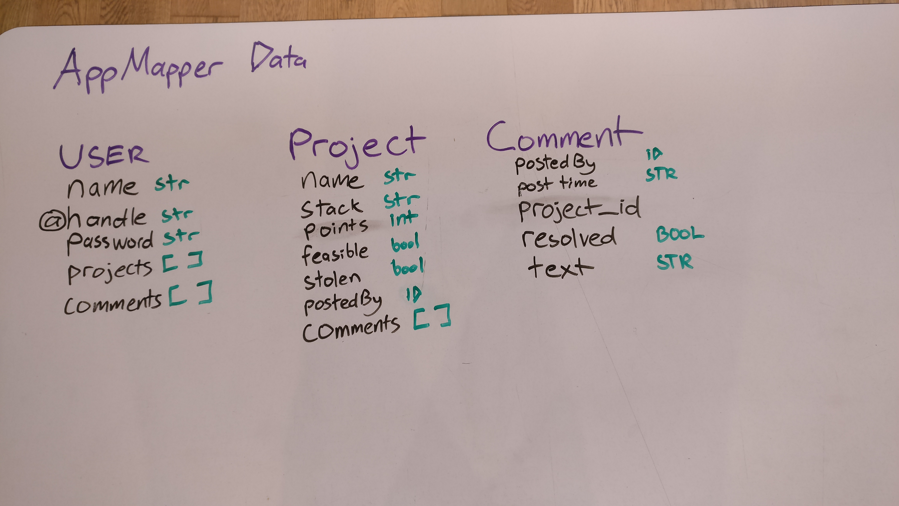
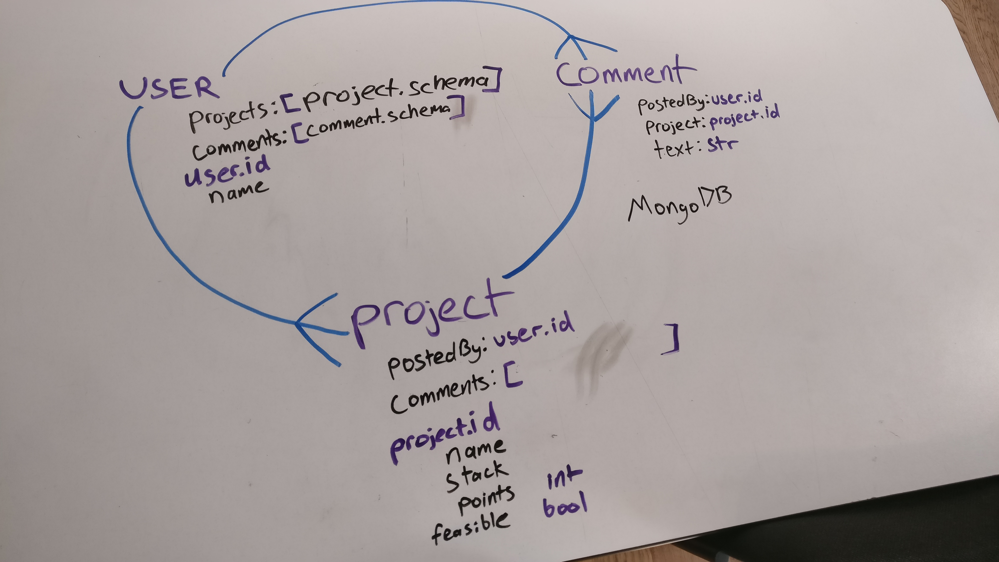

This project was bootstrapped with [Create React App](https://github.com/facebook/create-react-app).

# Deployed link here: https://glacial-crag-64052.herokuapp.com/

# How do I run this app locally?

- Clone this repo from gitHub

- Run `npm start` in the root directory to start the create-react-apps after installing all dependencies with `npm i`

- In another terminal window, connect to the mongoDB database with `mongod` 

- In a third terminal window, change directory into the backend server files with `cd backend` and run `nodemon server.js`

# Why this app?

Many times throughout the course, I tried to come up with original ideas for apps. Previous examples included a lunch budget tracker and a Tinder-inspired app for buying houseplants based on ease of care. I came up with AppMapper as a community for aspiring devs to pitch project ideas and receive feedback. Boot camp cohorts or self-study groups can use AppMapper as a project planning too,

# Planning diagrams

# What technologies were used?

- React.js

- Materialize.css

- Bootstrap 4

- MongoDB

# Unsolved problems and future features 

- Auth is not yet fully functional with protected routes and limited user roles (e.g not being able to delete other users' comments)

- Threaded comments appear on the same level and need to be nested base on how comments are embedded in each other.

- I will add the ability to tag projects by technologies used and a dropdown in the navbar to filter projects

- Incorporate pagination as numbers of projects grow

- The ability to report stolen app ideas.